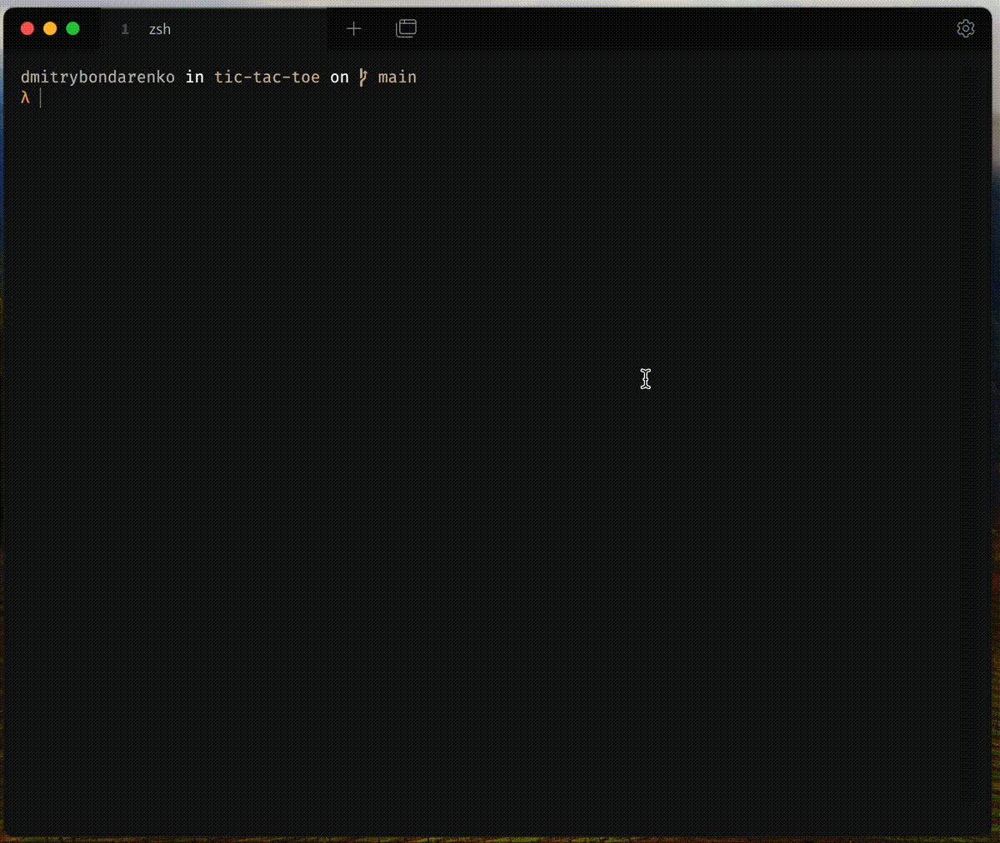

# Tic Tac Toe

Basic tic-tac-toe, but you can have only 3 symbols. Older ones will disappear

## Installation

1. Install Rust
2. Clone repo
3. Run `cargo run`

## Controls

- **Arrows** - move cursor
- **Enter**  - place symbol // start new game after end
- **ESC**    - exit 